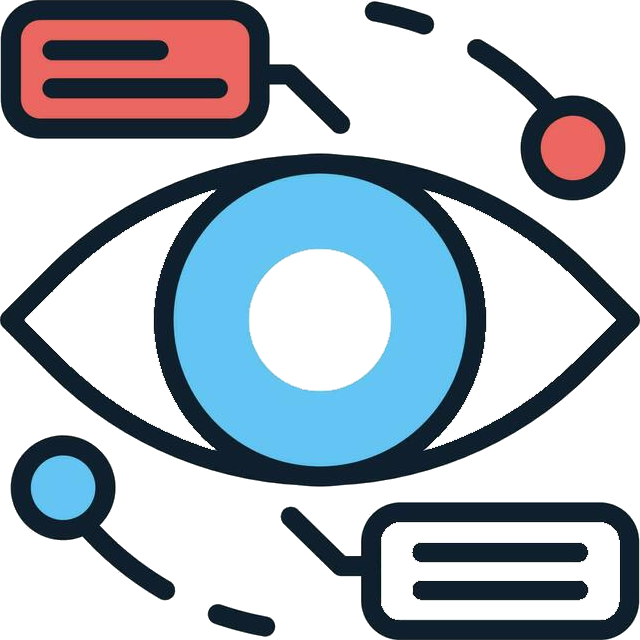

<!-- DOCUMENT HEADER -->
<a name="readme-top"></a>

[![Contributors][contributors-shield]][contributors-url]
[![Forks][forks-shield]][forks-url]
[![Stargazers][stars-shield]][stars-url]
[![Issues][issues-shield]][issues-url]


<!-- PROJECT LOGO -->
<br />
<div align="center">
  <a href="https://github.com/ChinaiArman/GarmentRecognitionAPI">
    
  </a>

<h3 align="center">Garment Recognition API</h3>

  <p align="center">
    An API that uses computer vision and semantic textual analysis to recognize clothing items through images.
    <br />
    <a href="https://github.com/ChinaiArman/GarmentRecognitionAPI/blob/main/ui/static/swagger.yaml"><strong>Explore the docs »</strong></a>
  </p>
</div>


<!-- TABLE OF CONTENTS -->
<details>
  <summary>Table of Contents</summary>
  <ol>
    <li>
      <a href="#about-the-project">About The Project</a>
      <ul>
        <li><a href="#built-with">Built With</a></li>
      </ul>
    </li>
    <li>
      <a href="#getting-started">Getting Started</a>
      <ul>
        <li><a href="#prerequisites">Prerequisites</a></li>
        <li><a href="#installation">Installation</a></li>
      </ul>
    </li>
    <li><a href="#usage">Usage</a></li>
    <li><a href="#deployment">Deployment</a></li>
    <li><a href="#developer-team">Developer Team</a></li>
    <li><a href="#acknowledgments">Acknowledgments</a></li>
  </ol>
</details>


<!-- ABOUT THE PROJECT -->
## About The Project

![Product Name Screen Shot][product-screenshot]

The Garment Recognition API is a RESTful API that uses computer vision and semantic textual analysis to recognize clothing items through images. The project was developed by a team of 5 students as part of BCIT's COMP 3800 course. The API leverages Azure's Dense Captioning model to generate textual descriptions of images, which are then processed by a custom-built NLP model to extract relevant information about the clothing items. The server is built using Flask and the API is documented using Swagger.

<p align="right">(<a href="#readme-top">back to top</a>)</p>

### Built With

* [![Python][Python]][Python-url]
* [![Pandas][Pandas]][Pandas-url]
* [![Flask][Flask]][Flask-url]
* [![Azure][Azure]][Azure-url]
* [![HuggingFace][HuggingFace]][HuggingFace-url]
* [![Swagger][Swagger]][Swagger-url]

<p align="right">(<a href="#readme-top">back to top</a>)</p>


<!-- GETTING STARTED -->
## Getting Started

The following instructions will guide you through setting up the project on your local machine.

### Prerequisites

1. Python (version 3.11 or higher)
    - Download and install Python from [here](https://www.python.org/downloads/).
        - Ensure that you check the box that says "Add Python to PATH" during installation.
        - Ensure that you check the box that says "Install pip" during installation.
    - Verify installation by running the following command in your terminal:
    ```sh
    python --version        # Check the version of Python
    ```

2. Pip (Python package installer)
    - Verify installation by running the following command in your terminal:
    ```sh
    pip --version       # Check the version of pip
    ```

3. VSCode (or any other code editor).
    - Download and install VSCode from [here](https://code.visualstudio.com/).

4. An Azure Dense Captioning model API Key.

5. An NVIDIA GPU (optional, but recommended for faster processing).
    
### Installation

1. Clone the repo
   ```sh
   git clone https://github.com/ChinaiArman/GarmentRecognitionAPI.git       # Clone the repository
    ```

2.  Create a virtual environment

    2.1 Create a virtual environment using the following commands:
    ```sh
    cd GarmentRecognitionAPI            # Change to the project directory
    python -m venv .venv                 # Create a virtual environment
    ```
    2.2 Activate the virtual environment:
    - Mac:
        - Activation command: 
            ```sh
            source .venv/bin/activate     # Activate the virtual environment
            ```
        - Deactivation command: 
            ```sh
            source .venv/bin/deactivate       # Deactivate the virtual environment
            ```
    - Windows:
        - Activation command:
            ```sh
            .venv\Scripts\activate.bat        # Activate the virtual environment
            ```
        - Deactivation command:
            ```sh
            .venv\Scripts\deactivate.bat      # Deactivate the virtual environment
            ```
        Your interpreter should now be set to the Virtual Environment instance of python.

3. Install required Python libraries
    ```sh
    cd server                           # Change to the server directory
    pip install -r requirements.txt     # Install the required libraries
    ```

4. Set up environment variables
    - Create a `.env` file in the server directory of the project.
    - Add the following environment variables to the `.env` file:
    ```sh
    AZURE_VISION_ENDPOINT=""        # your_azure_vision_endpoint
    AZURE_VISION_KEY_1=""           # your_azure_vision_key
    AZURE_VISION_KEY_2=""           # your_azure_vision_key
    RAPID_API_KEY=""                # your_rapid_api_key
    EMBEDDED_MODEL=""               # your_embedded_model
    DATA_SOURCE_FILE=""             # your_data_source_file
    PYTHONPATH="server"             # Set the PYTHONPATH to "server"
    ```
    - Replace the placeholder values with your own API keys and file paths.

<p align="right">(<a href="#readme-top">back to top</a>)</p>


<!-- USAGE EXAMPLES -->
## Usage

1. Start the server by running the following command:
    ```sh
    cd ..                       # Return to the root directory
    python server/app.py        # Start the server
    ```

2. Access the API documentation at `http://localhost:5000/` to view the available endpoints and interact with the API.

3. You can also use client software of your choice (cURL, Postman, etc.) to send HTTP requests to the endpoints. The API documentation will guide you in how to format any request bodies and path parameters for the HTTP requests.

<p align="right">(<a href="#readme-top">back to top</a>)</p>


<!-- DEPLOYMENT EXAMPLES -->
## Deployment

### Full Deployment (server and UI)
The full API can be deployed to a cloud platform such as Azure or AWS directly.
1. Ensure that the required environment variables are set in the deployment environment.
2. Set the entry point of the server to `server/app.py`.
3. Deploy the server to the cloud platform of your choice. The server will serve the Swagger UI at the root URL, and will respond to all other API requests as a RESTful API.

### Flask Server Deployment (only for the server)
The API server can be deployed to a cloud platform such as Azure or AWS with minimal changes.
1. Ensure that the required environment variables are set in the deployment environment.

2. In app.py, change the initialization of the Flask app (line 29 in `server/app.py`) to the following:
    ```python
    app = Flask(__name__)
    ```

3. In app.py, change the root route of the Flask server (line 330 in `server/app.py`) to the following:
    ```python
    return jsonify("Hello World")
    ```

4. Deploy the server folder to the cloud platform of your choice.

### Swagger UI Deployment (only for the UI)

The Swagger frontend can be deployed to GitHub Pages or any other static site hosting service.
- A guide to deploying the Swagger UI to GitHub can be found [here](https://github.com/peter-evans/swagger-github-pages).
- Swagger can also be deployed on any major cloud platform such as Azure or AWS.
    - A guide to deploying Swagger on AWS can be found [here](https://aws.amazon.com/blogs/devops/deploy-and-manage-openapi-swagger-restful-apis-with-the-aws-cloud-development-kit/).
    - A guide to deploying Swagger on Azure can be found [here](https://blog.cellenza.com/en/cloud/how-to-quickly-deploy-swagger-documentation-for-your-api-in-azure/).

The Swagger YAML file can be found [here](https://github.com/ChinaiArman/GarmentRecognitionAPI/blob/main/ui/static/swagger.yaml). Ensure that all references to the server are updated to the deployed server URL.

<p align="right">(<a href="#readme-top">back to top</a>)</p>


<!-- CONTACT -->
## Developer Team

Arman Chinai:

[![LinkedIn][linkedin-shield]][arman-linkedin] [![GitHub][github-shield]][arman-github]

Lex Wong:

[![LinkedIn][linkedin-shield]][lex-linkedin] [![GitHub][github-shield]][lex-github]

Natalie Yu:

[![LinkedIn][linkedin-shield]][natalie-linkedin] [![GitHub][github-shield]][natalie-github]

Ehsan Emadi:

[![LinkedIn][linkedin-shield]][ehsan-linkedin] [![GitHub][github-shield]][ehsan-github]

Collin Chan:

[![LinkedIn][linkedin-shield]][collin-linkedin] [![GitHub][github-shield]][collin-github]

Project Link:

[![GitHub][github-shield]][project-github]

<p align="right">(<a href="#readme-top">back to top</a>)</p>


<!-- ACKNOWLEDGMENTS -->
## Acknowledgments

* Chris Thompson - Project Supervisor
    
    - [![GitHub][github-shield]][chris-github]

* Farnaz Dargahi - COMP 3800 Instructor
* Laura Aslan - Founder and CEO of Odd Fabric, owner of this product
* Will Stahl - Laura’s business partner, co-owner of this product

Thank you for your continued support throughout the project!

<p align="right">(<a href="#readme-top">back to top</a>)</p>


<!-- MARKDOWN LINKS & IMAGES -->
<!-- https://www.markdownguide.org/basic-syntax/#reference-style-links -->
[product-screenshot]: resources/demo.png
[contributors-shield]: https://img.shields.io/github/contributors/chinaiarman/GarmentRecognitionAPI.svg?style=for-the-badge
[contributors-url]: https://github.com/ChinaiArman/GarmentRecognitionAPI/graphs/contributors
[forks-shield]: https://img.shields.io/github/forks/ChinaiArman/GarmentRecognitionAPI.svg?style=for-the-badge
[github-shield]: https://img.shields.io/badge/GitHub-100000?style=for-the-badge&logo=github&logoColor=white
[forks-url]: https://github.com/ChinaiArman/GarmentRecognitionAPI/network/members
[stars-shield]: https://img.shields.io/github/stars/ChinaiArman/GarmentRecognitionAPI.svg?style=for-the-badge
[stars-url]: https://github.com/ChinaiArman/GarmentRecognitionAPI/stargazers
[issues-shield]: https://img.shields.io/github/issues/ChinaiArman/GarmentRecognitionAPI.svg?style=for-the-badge
[issues-url]: https://github.com/ChinaiArman/GarmentRecognitionAPI/issues
[license-shield]: https://img.shields.io/github/license/ChinaiArman/GarmentRecognitionAPI.svg?style=for-the-badge
[license-url]: https://github.com/ChinaiArman/GarmentRecognitionAPI/blob/master/LICENSE.txt
[linkedin-shield]: https://img.shields.io/badge/-LinkedIn-black.svg?style=for-the-badge&logo=linkedin&colorB=555
[linkedin-url]: https://linkedin.com/in/linkedin_username
[product-screenshot]: images/screenshot.png
[Python]: https://img.shields.io/badge/Python-3776AB?style=for-the-badge&logo=python&logoColor=white
[Python-url]: https://www.python.org/
[Flask]: https://img.shields.io/badge/Flask-000000?style=for-the-badge&logo=flask&logoColor=white
[Flask-url]: https://flask.palletsprojects.com/en/2.0.x/
[Azure]: https://img.shields.io/badge/Microsoft_Azure-0089D6?style=for-the-badge&logo=microsoft-azure&logoColor=white
[Azure-url]: https://azure.microsoft.com/en-us/
[Pandas]: https://img.shields.io/badge/pandas-150458?style=for-the-badge&logo=pandas&logoColor=white
[Pandas-url]: https://pandas.pydata.org/
[Swagger]: https://img.shields.io/badge/Swagger-85EA2D?style=for-the-badge&logo=swagger&logoColor=black
[Swagger-url]: https://swagger.io/
[HuggingFace]: https://img.shields.io/badge/Hugging%20Face-FFD000?style=for-the-badge&logo=huggingface&logoColor=black
[HuggingFace-url]: https://huggingface.co/
[arman-linkedin]: https://www.linkedin.com/in/armanchinai/
[arman-github]: https://github.com/ChinaiArman/
[lex-linkedin]: https://www.linkedin.com/in/alexandra-wong-8188a122a/
[lex-github]: https://github.com/levxxvi/
[ehsan-linkedin]: https://www.linkedin.com/in/ehsan-emadi
[ehsan-github]: https://github.com/Ehsan138
[collin-linkedin]: https://www.linkedin.com/in/collin-c-94539a224/
[collin-github]: https://github.com/cc-dev-65535
[natalie-linkedin]: https://www.linkedin.com/in/natalieyu74/
[natalie-github]: https://github.com/nataliecly
[project-github]: https://github.com/ChinaiArman/GarmentRecognitionAPI
[chris-github]: https://github.com/chris-thompson/